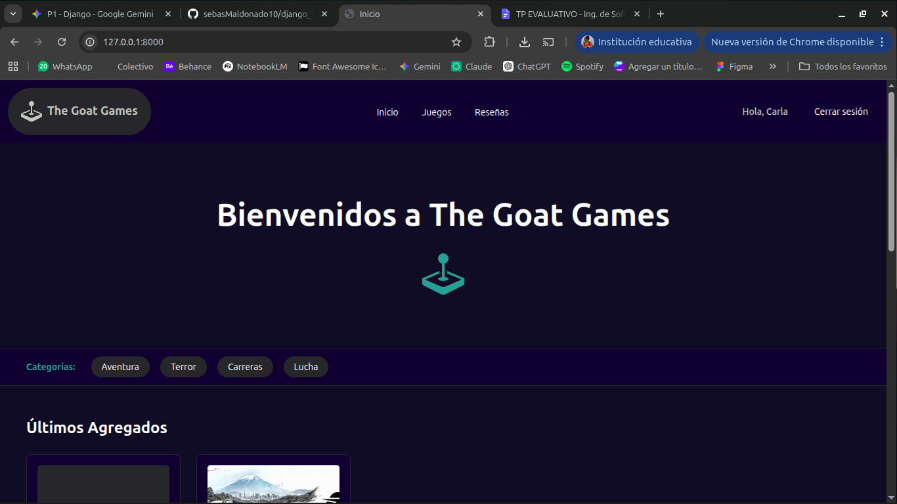
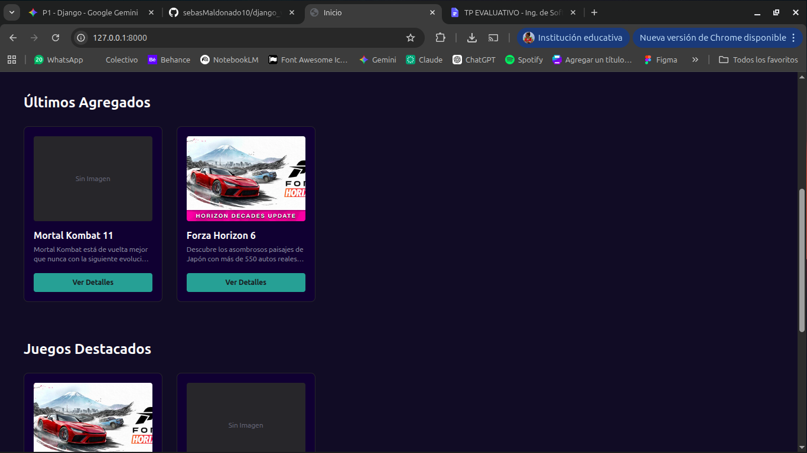
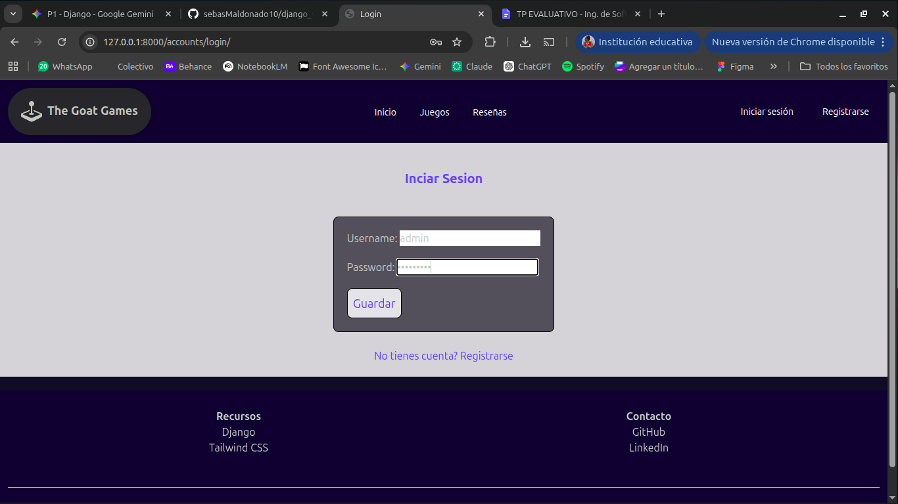
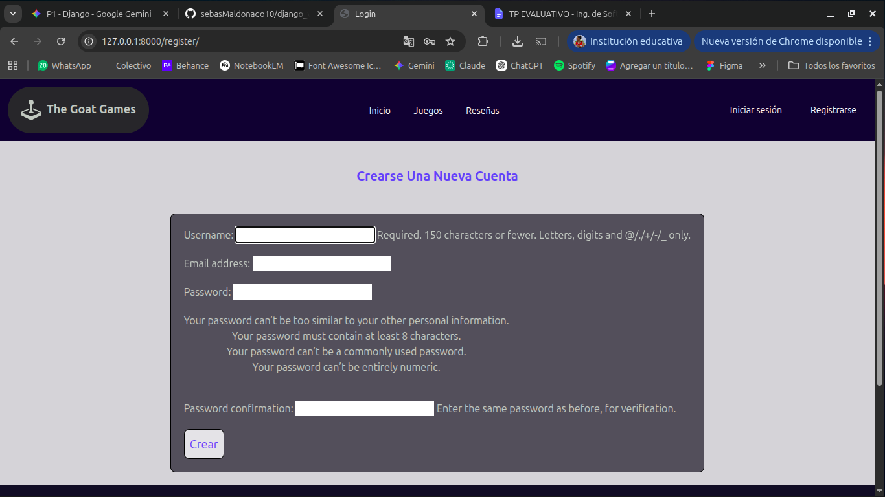
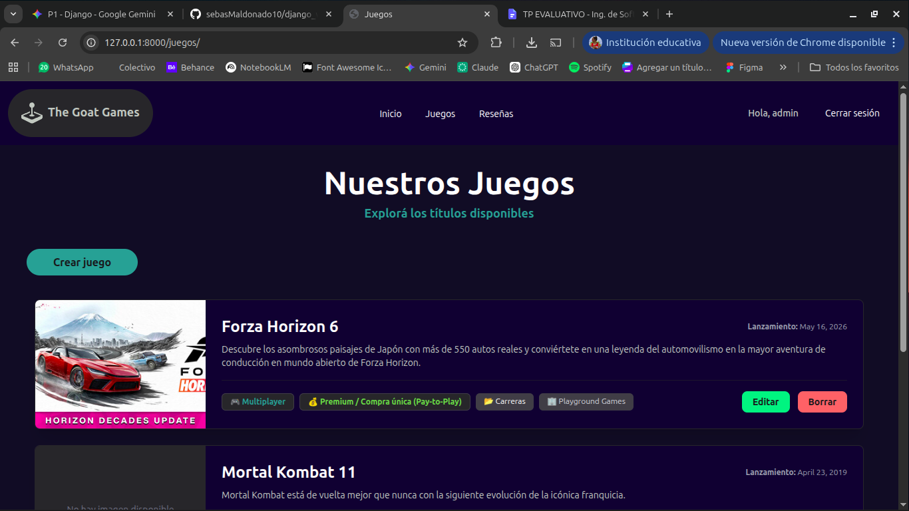
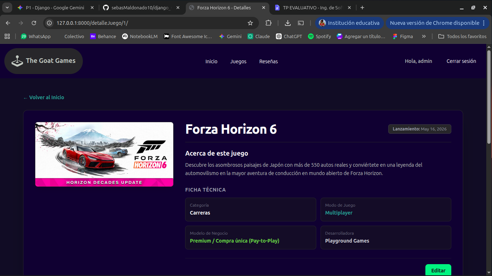
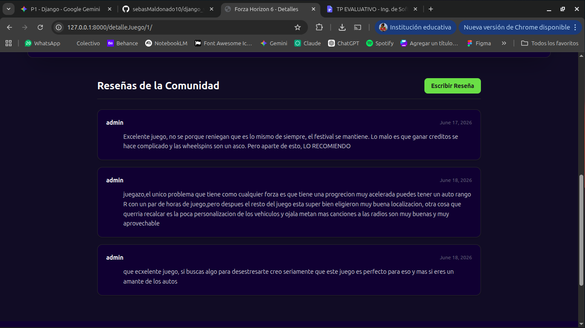
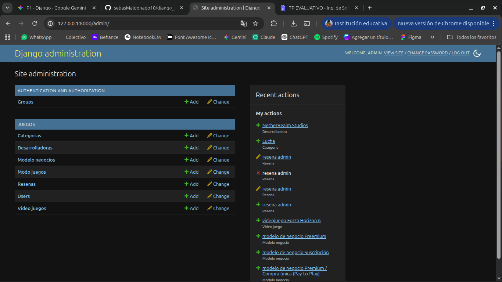
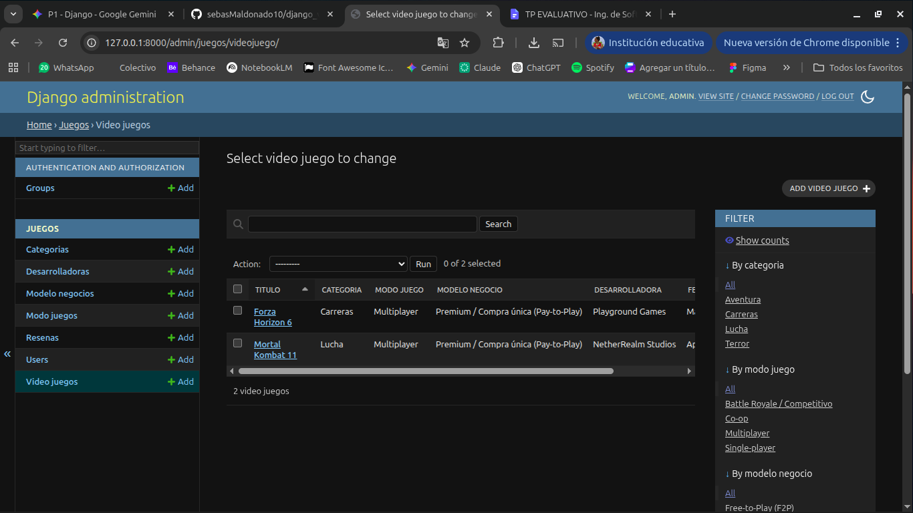

# 🎮 Plataforma de Videojuegos - The Goat Games

¡Bienvenido a nuestra plataforma de gestión de videojuegos! Este proyecto es una aplicación web desarrollada con **Django** que permite administrar un catálogo de juegos, gestionar reseñas de usuarios y controlar el sistema mediante un panel de administración.

---

## Integrantes

*  Maldonado, Sebastian
*  Nadalig, Carla
*  Urquiza, Mateo

## 🚀 Funcionalidades Principales

*   **🌐 Navegación Dinámica:** Sistema completo de navegación a través de templates heredados (`base.html`).
*   **🔐 Autenticación de Usuarios:** Sistema de registro, inicio y cierre de sesión de usuarios (`django.contrib.auth`).
*   **📝 CRUD Completo:** Gestión total (Crear, Leer, Actualizar, Borrar) para modelos Videojuegos y Reseñas.
*   **🛡️ Panel de Administración Avanzado:** Control total desde `/admin` con filtros personalizados, búsquedas y ordenamiento de registros.

---

## 📸 El Proyecto en Funcionamiento

### 🏠 1. Página de Inicio y Navegación
*Vista principal de la plataforma donde se puede navegar hacia las distintas secciones y el catálogo.*



### 🔐 2. Sistema de Autenticación (Login / Registro)
*Formularios de ingreso y registro para los usuarios del sistema.*



### 📋 3. Gestión del Catálogo (CRUD)
*Demostración de las pantallas para listar, dar de alta, editar y eliminar videojuegos.*




*Interfaz de formularios para la creación/edición de registros.*
![Formulario de Creación]

### ⚙️ 4. Panel de Administración (Django Admin)
*Vista del panel de control con filtros laterales, barra de búsqueda y ordenamiento de los modelos configurados.*



---

## 🛠️ Tecnologías Utilizadas

*   **Backend:** Django / Python
*   **Base de Datos:** SQLite
*   **Frontend:** HTML5, CSS3 (Tailwind)

---

## 💻 Instrucciones para Ejecución Local

Si querés correr el proyecto en tu máquina, seguí estos pasos:

1. **Clonar el repositorio:**
```bash
   git clone git@github.com:sebasMaldonado10/django_videojuegos.git
   cd plataforma_videojuegos
```
2. **Crear y activar el entorno virtual:**
```bash
   python -m venv env
   # En Windows:
   env\Scripts\activate
   # En Mac/Linux:
   source env/bin/activate
```
3. **Instalar dependencias y migrar la base de datos:**
```bash
   pip install requirements.txt
   python manage.py migrate
```
4. **Crear un superusuario (para el panel de admin):**
```bash
   python manage.py createsuperuser
```
5. **Iniciar el servidor de desarrollo:**
```bash
    python manage.py runserver
```
**Entrá a http://127.0.0.1:8000/ en tu navegador.**

